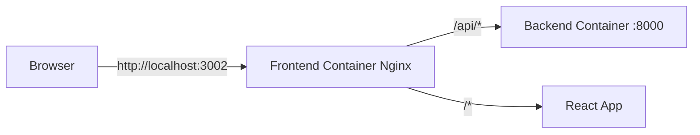
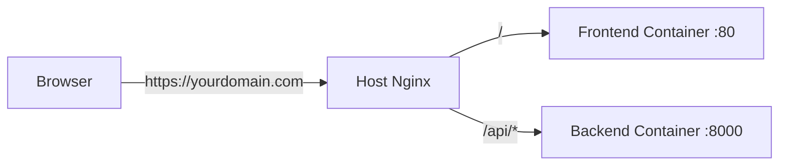

# API Endpoint Changes - `/api/` Prefix

This document explains the recent changes to use the `/api/` prefix for all API endpoints.

## Summary of Changes

All API endpoints now use the `/api/` prefix to enable seamless integration with reverse proxy configurations and same-domain API access.

## What Changed

### Backend (Django)

**File: `backend/ld_screening/urls.py`**

All URL patterns now have the `/api/` prefix:

| Old Endpoint | New Endpoint |
|--------------|--------------|
| `/admin/` | `/api/admin/` |
| `/start-session/` | `/api/start-session/` |
| `/get-next-question/` | `/api/get-next-question/` |
| `/submit-answer/` | `/api/submit-answer/` |
| `/end-session/` | `/api/end-session/` |
| `/get-dashboard-data/` | `/api/get-dashboard-data/` |
| `/get-user-history/` | `/api/get-user-history/` |
| `/reading/analyze-reading/` | `/api/reading/analyze-reading/` |
| `/reading/generate-sentence/` | `/api/reading/generate-sentence/` |

### Frontend (React + TypeScript)

**File: `frontend/src/services/api.ts`**

- Updated `API_BASE_URL` default from `http://localhost:3001` to `/api`
- All API calls now use relative paths through the same domain

**File: `frontend/.env` and `frontend/.env.example`**

- Changed `VITE_API_BASE_URL` from `http://localhost:3001` to `/api`

**File: `frontend/nginx.conf`**

- Added reverse proxy configuration to forward `/api/*` requests to the backend container

## How It Works

### Docker Setup (Current)



1. **Frontend** runs on `http://localhost:3002`
2. **Backend** runs on `http://localhost:3001` (mapped from container port 8000)
3. When frontend makes a request to `/api/start-session/`:
   - Nginx in frontend container intercepts it
   - Proxies to `http://s2hi-backend:8000/api/start-session/`
   - Backend responds
   - Response sent back to browser

### Production Setup (With Reverse Proxy)



1. **Host Nginx** listens on ports 80/443
2. Routes `/` to frontend container
3. Routes `/api/*` to backend container
4. Both accessible from same domain (no CORS issues)

## Benefits

✅ **No CORS Issues**: Frontend and backend on same domain  
✅ **Cleaner URLs**: All API endpoints clearly identified with `/api/` prefix  
✅ **Production Ready**: Works seamlessly with reverse proxy  
✅ **Flexible**: Can switch between direct access and proxy easily

## Testing the Changes

### 1. Access Frontend

```bash
# Open in browser
http://localhost:3002
```

### 2. Test API Endpoints

The frontend will automatically make requests to `/api/*` which will be proxied to the backend.

### 3. Direct Backend Access (Optional)

You can still access the backend directly:

```bash
# Direct backend access
curl http://localhost:3001/api/start-session/ \
  -X POST \
  -H "Content-Type: application/json" \
  -d '{"age_group": "9-11"}'
```

### 4. Admin Panel

Access the Django admin at:

```
http://localhost:3001/api/admin/
```

Or through the frontend proxy:

```
http://localhost:3002/api/admin/
```

## Environment Variables

### Development (Docker)

**frontend/.env**
```env
VITE_API_BASE_URL=/api
```

### Alternative: Direct Backend Access

If you need to bypass the proxy and access backend directly:

**frontend/.env**
```env
VITE_API_BASE_URL=http://localhost:3001/api
```

### Production

**frontend/.env**
```env
VITE_API_BASE_URL=/api
```

> [!IMPORTANT]
> After changing `.env` files, you **must rebuild** the frontend container:
> ```bash
> docker-compose up -d --build frontend
> ```

## Troubleshooting

### Issue: API requests failing

**Check 1: Verify containers are running**
```bash
docker-compose ps
```

Both containers should show "Up" status.

**Check 2: Check backend logs**
```bash
docker-compose logs backend
```

Look for Django server startup message: `Starting development server at http://0.0.0.0:8000/`

**Check 3: Verify Nginx configuration**
```bash
docker-compose exec frontend nginx -t
```

Should show: `nginx: configuration file /etc/nginx/conf.d/default.conf test is successful`

**Check 4: Test backend directly**
```bash
curl http://localhost:3001/api/start-session/ \
  -X POST \
  -H "Content-Type: application/json" \
  -d '{"age_group": "9-11"}'
```

### Issue: 404 Not Found

Make sure you're using the `/api/` prefix:

❌ Wrong: `http://localhost:3001/start-session/`  
✅ Correct: `http://localhost:3001/api/start-session/`

### Issue: CORS errors

If you see CORS errors, it means the proxy isn't working. Check:

1. Frontend `.env` has `VITE_API_BASE_URL=/api`
2. Frontend container was rebuilt after changing `.env`
3. Nginx config has the `/api/` location block

## Rollback (If Needed)

If you need to revert to the old configuration:

### Backend
```python
# backend/ld_screening/urls.py
urlpatterns = [
    path('admin/', admin.site.urls),
    path('', include('assessment.urls')),
    path('reading/', include('reading_analysis.urls')),
]
```

### Frontend
```env
# frontend/.env
VITE_API_BASE_URL=http://localhost:3001
```

```typescript
// frontend/src/services/api.ts
const API_BASE_URL = import.meta.env.VITE_API_BASE_URL || 'http://localhost:3001';
```

Then rebuild:
```bash
docker-compose down
docker-compose up -d --build
```

## Summary

The `/api/` prefix makes the application production-ready and eliminates CORS issues by enabling same-domain API access. All endpoints are now consistently prefixed, making the API structure clearer and easier to manage.
